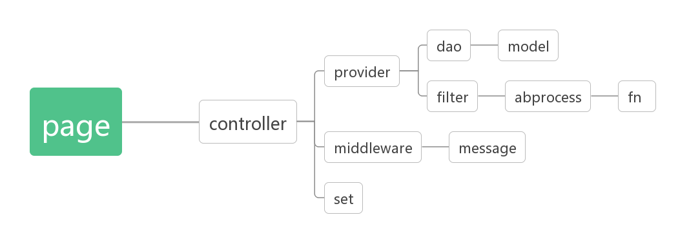

## 微信小程序模板

## 架构

`controller` 控制层
1. `provider` 服务提供者
    1. `dao` 数据接口层
        1. `model` 数据请求层
    2. `filter` 过滤器
        1. `abprocess` 数据处理中心
            1. `fn` 纯函数
2. `middleware` 中间件
    1. `message` 消息通知
3. `set` 数据设置

v0.1.13